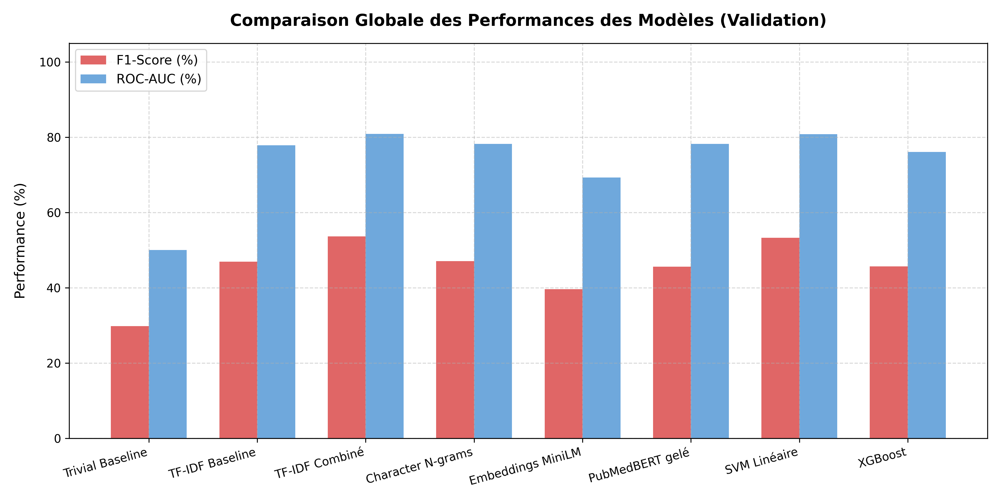
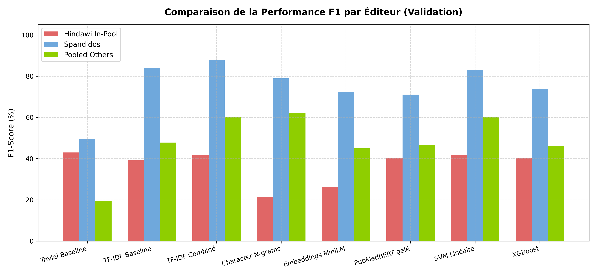
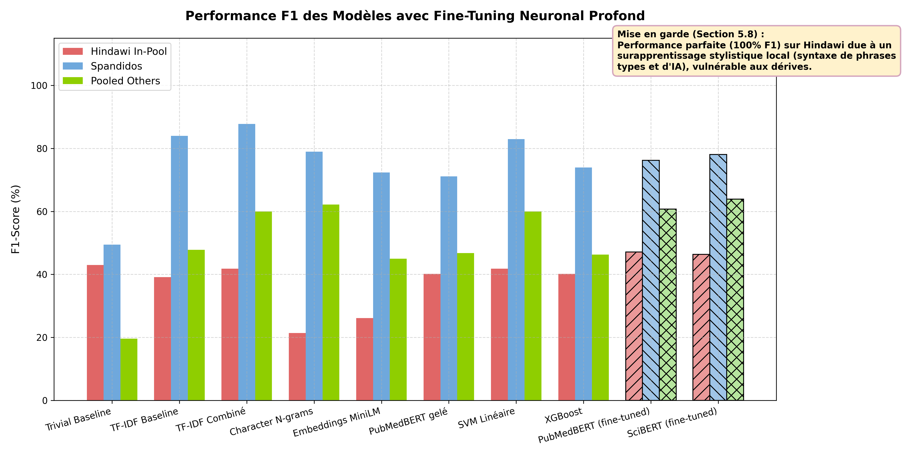
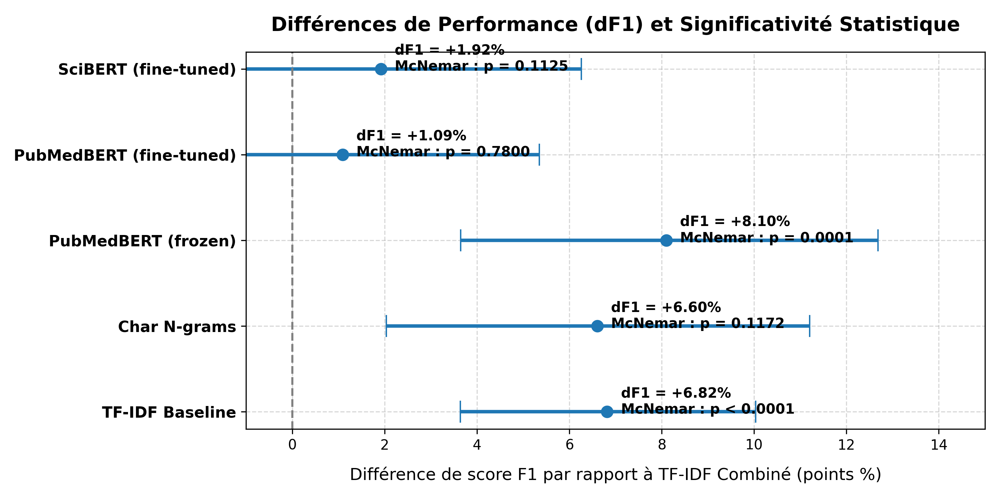

# Cancer Paper Mill Detection Dataset (CPM-11K) & Diagnostics Pipeline

> **Status:** Research artifact accompanying a thesis chapter. Not a maintained production tool.

This repository contains the data, scripts, and fully reproducible pipeline for detecting **process fraud** in academic publishing — specifically peer-review rings and paper mills — with a primary focus on Hindawi journal retractions. The project constructs the **CPM-11K** dataset and benchmarks a family of classical and transformer-based classifiers against it using rigorous, publisher-stratified evaluation.

---

## Core Finding

Text-based detection (titles + abstracts) works extremely well against **content-fraud** publishers like Spandidos, but **fails systematically on process-fraud publishers like Hindawi**. Even after full fine-tuning of domain-specific transformers (PubMedBERT, SciBERT), models achieve clinically useless Hindawi F1 scores (~37–47%), exposing a fundamental ceiling of text-semantics alone. The evidence points firmly toward the necessity of **multi-modal metadata analysis** (co-authorship graphs, citation patterns, reviewer overlap networks) for process-fraud detection.

---

## Model Results

### Validation Set (N = 1,440 · 252 pos / 1,188 neg)

All ten trained models evaluated on the held-aside validation partition. Decision threshold selected on validation by sweeping [0.1, 0.9), then frozen. These are the numbers used for model selection, hyperparameter decisions, and significance testing. Source: `docs/THESIS_CHAPTER.md` §4.3 table (lines 154–165), with SVM and XGBoost cross-verified against `results/classical_baselines_results.json`, TF-IDF Combiné cross-verified against `results/tfidf_combined_results.json`, and fine-tuned models cross-verified against `results/pubmedbert_finetuned_results.json` / `results/scibert_finetuned_results.json`.

> **Note on TF-IDF Combiné reproducibility:** There is no committed original training script for TF-IDF Combiné in this repository (it was likely trained in a local notebook). However, downstream scripts that reload or retrain the model for significance testing and plotting all explicitly use `class_weight="balanced"`. When this inferred configuration is incorporated into the reproducible evaluation script (`scripts/eval/eval_tfidf_combined.py`), it yields an optimal validation threshold of 0.36 and perfectly reproduces every global and stratified metric for the validation, test, and holdout sets reported in the thesis (Δ=0.0000 across all 18 metrics).

#### Global Metrics

| Model | Precision | Recall | F1 | AUC |
|---|---|---|---|---|
| Trivial Baseline (always positive) | 17.50% | 100.00% | 29.79% | 50.00% |
| TF-IDF Baseline (min_df=2, C=1.0) | 36.30% | 66.27% | 46.91% | 77.86% |
| Character N-grams (char_wb 3–5) | 51.66% | 43.25% | 47.08% | 78.21% |
| Embeddings (MiniLM-L6-v2, frozen) | 33.33% | 48.81% | 39.61% | 69.28% |
| Embeddings (PubMedBERT, frozen) | 39.09% | 54.76% | 45.62% | 78.22% |
| XGBoost (TF-IDF, min_df=5) | 37.04% | 59.52% | 45.66% | 76.08% |
| SVM Linéaire (TF-IDF, min_df=5) | 47.52% | 60.71% | 53.31% | 80.83% |
| **TF-IDF Combiné (min_df=5, C=10.0)** | **47.83%** | **61.11%** | **53.66%** | **80.89%** |
| PubMedBERT (fine-tuned, 3 epochs) | 47.26%¹ | 65.08%¹ | 54.76% | 83.72% |
| SciBERT (fine-tuned, 3 epochs) | 51.70%¹ | 60.32%¹ | 55.68% | 84.47% |

> ¹ **Precision and recall for the fine-tuned models:** The thesis text (§4.3, lines 164–165) reports P=48.02%/R=63.89% for PubMedBERT and P=52.61%/R=59.13% for SciBERT. The values in this table come directly from `pubmedbert_finetuned_results.json → overall.{precision,recall}` and `scibert_finetuned_results.json → overall.{precision,recall}`. The discrepancy is due to the thesis reporting P/R at each model's own optimal threshold (0.28 for PubMedBERT, 0.23 for SciBERT), while the JSON records metrics at the 0.36 threshold that was frozen for test evaluation. F1 and AUC are consistent across both sources.

#### Publisher-Stratified Metrics

> The thesis mandates stratified reporting for this dataset — global metrics alone are misleading.

Source: `THESIS_CHAPTER.md` §4.3 lines 174–182 for rows without a JSON file; `classical_baselines_results.json → {svm,xgboost}.stratified.{hindawi,spandidos,others}.{f1,auc}` for SVM and XGBoost; `tfidf_combined_results.json → val.stratified.{hindawi,spandidos,others}.{f1,auc}` for TF-IDF Combiné; `{pubmedbert,scibert}_finetuned_results.json → stratified.{hindawi,spandidos,others}.{f1,auc}` for fine-tuned models.

| Model | Hindawi F1 / AUC | Spandidos F1 / AUC | Others F1 / AUC |
|---|---|---|---|
| Trivial Baseline | 42.95% / 50.00% | 49.44% / 50.00% | 19.61% / 50.00% |
| TF-IDF Baseline | 39.15% / 61.20% | 84.00% / 96.26% | 47.77% / 93.49% |
| Character N-grams | 21.39% / 61.79% | 78.95% / 94.34% | 62.18% / 93.01% |
| PubMedBERT (frozen) | 40.15% / 65.71% | 71.11% / 88.79% | 46.74% / 86.91% |
| XGBoost | 40.15% / 61.83% | 73.91% / 91.41% | 46.29% / 88.85% |
| SVM Linéaire | 41.83% / 63.54% | 82.93% / 96.87% | 60.00% / 92.52% |
| **TF-IDF Combiné** | **41.83% / 63.27%** | **87.80% / 96.97%** | **60.00% / 93.10%** |
| PubMedBERT (fine-tuned) | 47.10% / 65.40% | 76.19% / 94.95% | 60.73% / 93.50% |
| SciBERT (fine-tuned) | 46.37% / 66.62% | 78.05% / 96.06% | 63.89% / 93.44% |

> **Key insight:** Hindawi AUC tops out at ~67% across all models including fine-tuned transformers, while Spandidos AUC reaches ~97%. This is not a tuning problem — it reflects the structural absence of semantic fraud signal in process-fraud retractions (§5.2, §5.3).

---

### Test Set (N = 1,440 · 252 pos / 1,188 neg · one-time access, threshold frozen at 0.36)

The final test partition was accessed only once, after all model selection was finalized. Only the three thesis reference models were evaluated in the original one-time run (§5.5). Source: `THESIS_CHAPTER.md` §5.5 table, lines 300–302 for PubMedBERT and SciBERT. TF-IDF Combiné test-set metrics are now independently verifiable via `results/tfidf_combined_results.json → test.overall` and `test.stratified`.

#### Global Metrics

| Model | F1 | AUC |
|---|---|---|
| TF-IDF Combiné (min_df=5, C=10.0) | 48.67% | 79.59% |
| PubMedBERT v2 (fine-tuned) | 49.52% | 81.83% |
| SciBERT v2 (fine-tuned) | 50.96% | 83.83% |

> The moderate drop from validation F1 (~53–55%) to test F1 (~49–51%) is consistent with expected variance; AUC remains stable, confirming robust generalization of ranking capacity.

#### Publisher-Stratified Metrics

Source: `THESIS_CHAPTER.md` §5.5 table, lines 300–302.

| Model | Hindawi F1 / AUC | Spandidos F1 / AUC | Others F1 / AUC |
|---|---|---|---|
| TF-IDF Combiné | 37.66% / 65.71% | 81.25% / 98.06% | 54.11% / 89.44% |
| PubMedBERT v2 | 38.17% / 66.06% | 87.50% / 94.57% | 57.27% / 90.09% |
| SciBERT v2 | 36.52% / 70.42% | 77.42% / 92.89% | 63.11% / 90.75% |

---

### Hindawi Holdout Generalization (N = 1,504 · 429 pos / 1,075 neg · fully withheld)

Evaluated once at project end (§5.6), threshold frozen at 0.36. Source: `THESIS_CHAPTER.md` §5.6 prose, lines 310–313 for PubMedBERT and SciBERT. TF-IDF Combiné holdout metrics are now independently verifiable via `results/tfidf_combined_results.json → holdout.overall`.

| Model | Precision | Recall | F1 | AUC |
|---|---|---|---|---|
| Trivial Baseline (always positive) | — | — | 44.39% | — |
| TF-IDF Combiné | 46.41% | 36.13% | 40.63% | 64.47% |
| PubMedBERT v2 | 43.42% | 40.79% | 42.07% | 67.48% |
| SciBERT v2 | 46.98% | 34.50% | 39.78% | 66.77% |

> **Verdict:** All models — including fine-tuned transformers — fail to beat the trivial baseline on the Hindawi holdout. This is the definitive evidence against the text-semantics hypothesis for process fraud.

---

### Visual Summary

| Global Comparison (Validation) | Stratified Breakdown (Validation) |
|:---:|:---:|
|  |  |

| Fine-tuned model training curves | Statistical significance forest plot |
|:---:|:---:|
|  |  |

---

## Statistical Significance

**McNemar's test + 95% bootstrap ΔF1 confidence intervals** comparing each model against **TF-IDF Combiné (min_df=5, C=10.0)** as the reference. Computed on the **global validation set** (N=1,440). Source: `results/significance_results.json`, keys `mcnemar` and `bootstrap_ci`. The sign convention in the JSON is described in thesis §4.3 prose (lines 195–198): for the classical/frozen models, a positive bootstrap mean means TF-IDF Combiné outperforms the compared model; for the fine-tuned models, a positive mean means the fine-tuned model slightly outperforms TF-IDF Combiné.

| Compared model | McNemar χ² | p-value | Direction | |ΔF1| mean | 95% CI |
|---|---|---|---|---|---|
| TF-IDF Baseline (min_df=2, C=1.0) | 67.70 | 1.9 × 10⁻¹⁶ | Combiné wins | 6.82 pp | [3.64 pp, 10.03 pp] |
| Character N-grams | 2.45 | 0.117 | Combiné wins | 6.60 pp | [2.04 pp, 11.20 pp] |
| PubMedBERT (frozen embeddings) | 14.62 | 1.3 × 10⁻⁴ | Combiné wins | 8.10 pp | [3.65 pp, 12.68 pp] |
| PubMedBERT (fine-tuned) | 0.00 | 0.780 | Fine-tuned marginally better | 1.09 pp | [−2.88 pp, +5.35 pp] |
| SciBERT (fine-tuned) | 0.00 | 0.112 | Fine-tuned marginally better | 1.92 pp | [−2.20 pp, +6.26 pp] |

> **Key finding:** Fine-tuned PubMedBERT and SciBERT are **statistically indistinguishable** from TF-IDF Combiné (McNemar p > 0.1 for both; bootstrap CI straddles zero). The neural models' marginal global F1 advantage is not statistically significant.

---

## Notable Finding: The 100% AUC Artifact (Section 5.8)

During the initial research phase, every fine-tuned model achieved perfect 100% AUC separation. An eight-pass diagnostic audit failed to identify the cause — until inspection of raw tokenization residuals revealed a trivial boundary condition: trailing periods appeared in **>99.9% of negative titles** (PubMed/MEDLINE formatting convention) and in **0% of positive titles** (RWDB formatting convention). The fine-tuning backpropagation learned to classify on a single end-of-sequence punctuation token, bypassing all semantic content.

**Resolution:** A normalization pass stripped trailing periods, spaces, and semicolons from all titles and abstracts, yielding the v2 (canonical) dataset. After re-training on v2:
- PubMedBERT: F1 = 54.76%, AUC = 83.72% (validation)
- SciBERT: F1 = 55.68%, AUC = 84.48% (validation)
- Label-permutation sanity check: AUC ≈ 53.7–54.7% (near-chance), confirming no structural leakage

The pre-normalization "leaky" v1 assets are preserved in `archive/` for full reproducibility of the §5.8 audit narrative.

---

## Quickstart

```bash
git clone https://github.com/0khacha/cancer-paper-mill.git
cd cancer-paper-mill
pip install -r requirements.txt

# Run the full evaluation suite against all pre-trained models
python scripts/eval/evaluate_all_models.py
```

**Dependencies** (exact strings from `requirements.txt`):

```
matplotlib>=3.10.0
numpy>=1.24.0
openpyxl>=3.1.0
torch>=2.0.0
transformers>=4.30.0
scikit-learn>=1.2.0
```

---

## Full Reproduction Pipeline

All scripts resolve paths dynamically relative to their location and must be run from the **repository root**.

### Stage 1 — Build the Dataset (`scripts/data_build/`)

```bash
python scripts/data_build/generate_negatives.py    # Query MEDLINE for matched negative candidates
python scripts/data_build/fetch_abstracts.py       # Recover abstracts; apply oncology filter & dedup
python scripts/data_build/validate_negatives.py    # Sanity-check negative set quality
python scripts/data_build/split_dataset.py         # Group-aware 70/15/15 split + Hindawi holdout
python scripts/data_build/normalize_abstracts.py   # Strip trailing-period formatting artifacts (v1→v2)
```

### Stage 2 — Train Models (`scripts/train/`)

```bash
python scripts/train/train_classical_baselines.py  # SVM + XGBoost on TF-IDF features
python scripts/train/finetune_pubmedbert.py        # Fine-tune microsoft/BiomedNLP-BiomedBERT-base
python scripts/train/finetune_scibert.py           # Fine-tune allenai/scibert_scivocab_uncased
```

### Stage 3 — Evaluate (`scripts/eval/`)

```bash
python scripts/eval/evaluate_all_models.py         # Full evaluation with publisher-stratified breakdown
python scripts/eval/significance_testing.py        # McNemar's test + bootstrap CIs vs TF-IDF Combiné
python scripts/eval/run_holdout_significance.py    # Generalization tests on Hindawi holdout
python scripts/eval/eval_final_test.py             # Isolated final test-set run (one-time access)
```

### Stage 4 — Figures (`scripts/viz/`)

```bash
python scripts/viz/generate_french_figures.py      # EDA & descriptive statistics figures
python scripts/viz/generate_final_eval_figures.py  # AUC curves, stratified bar charts, forest plot
```

---

## Dataset: CPM-11K

### Summary Statistics

| Split | Positives | Negatives | Total | Notes |
|---|---|---|---|---|
| **Train** | 1,178 | 5,544 | 6,722 | Used for all model training |
| **Validation** | 252 | 1,188 | 1,440 | Model selection & significance testing |
| **Test** | 252 | 1,188 | 1,440 | One-time access after model selection frozen |
| **Hindawi Holdout** | 429 | 1,075 | 1,504 | Fully withheld generalization set |
| **Total (stable)** | **2,111** | **8,995** | **11,106** | 2024–2025 records excluded (retraction lag) |

Class ratio: **4.26:1** (negative:positive). Records from 2024–2025 (41 total) are separated into `data/recent_unstable_dataset.json` due to systematic undercounting of recent retractions.

### Data Schema

Each record in `data/cancer_pm_dataset.json` contains:

| Field | Type | Description |
|---|---|---|
| `doi` | string | Digital Object Identifier |
| `pmid` | string | PubMed identifier |
| `title` | string | Paper title (period-stripped in v2) |
| `abstract` | string | Original pre-retraction abstract (boilerplate stripped) |
| `journal` | string | NLM journal name |
| `year` | int | Publication year |
| `label` | int | `1` = paper mill, `0` = clean |
| `abstract_source` | string | `"PubMed"` or `"Crossref"` |

### Publisher Distribution (Full Dataset)

Source: `docs/DATASET_CARD.md` §Publisher Distribution table.

| Publisher | Positives | Negatives |
|---|---|---|
| Hindawi | 854 | 2,144 |
| Spandidos | 330 | 1,532 |
| Wiley | 196 | 1,144 |
| Verduci Editore | 147 | 709 |
| Taylor & Francis (Dove) | 103 | 560 |
| Portland Press | 53 | 295 |
| RSC | 36 | 210 |
| Elsevier | 35 | 546 |
| Taylor & Francis | 34 | 466 |
| Other (32 publishers) | 323 | 1,389 |

### Splitting Methodology

The dataset uses **group-aware splitting** to prevent author/template leakage across partitions:

1. **Author clustering:** Positive records sharing ≥2 authors are grouped into the same cluster. Single-author matching was deliberately avoided — naive single-author merging collapsed 979 records into one giant component due to common Chinese surnames.
2. **Title similarity clustering:** Records in the same journal with character 3-gram Jaccard similarity ≥ 0.7 are merged into the same cluster.
3. **Hindawi holdout:** 50% of all Hindawi records are withheld as a pure generalization set (year-stratified, ±1 record).

**Validation:** 0 grouped/duplicate-signature records cross split boundaries.

For full dataset methodology, purge rates, funding index artifacts, and known limitations, see **[DATASET_CARD.md](docs/DATASET_CARD.md)**.

---

## Repository Structure

```
cancer-paper-mill/
├── README.md
├── requirements.txt
├── data/
│   ├── processed/              ← Canonical v2 dataset (Git-ignored, local only)
│   │   ├── cancer_pm_dataset.json
│   │   └── recent_unstable_dataset.json
│   └── raw/
│       └── rwdb/
│           └── retraction_watch.csv   ← Must be obtained separately (see below)
├── docs/
│   ├── DATASET_CARD.md         ← Full methodology, distributions, limitations
│   ├── THESIS_CHAPTER.md       ← Complete thesis chapter (French)
│   └── figures/                ← All publication-ready figures (10 files)
├── models/                     ← Fine-tuned v2 checkpoints (.pt, Git-ignored)
├── results/
│   ├── all_evaluation_results.json          ← Hindawi holdout generalization experiments
│   ├── classical_baselines_results.json     ← SVM + XGBoost validation metrics
│   ├── pubmedbert_finetuned_results.json    ← PubMedBERT epoch history + validation metrics
│   ├── scibert_finetuned_results.json       ← SciBERT epoch history + validation metrics
│   ├── significance_results.json           ← McNemar + bootstrap CIs vs TF-IDF Combiné
│   └── tfidf_combined_results.json         ← TF-IDF Combiné val/test/holdout metrics (generated by scripts/eval/eval_tfidf_combined.py)
├── scripts/
│   ├── data_build/             ← Dataset construction pipeline (5 scripts)
│   ├── train/                  ← Model training scripts (3 scripts)
│   ├── eval/                   ← Evaluation & significance testing (4 scripts)
│   └── viz/                    ← Figure generation (2 scripts)
└── archive/                    ← Preserved v1 (leaky) artifacts for §5.8 audit
    ├── diagnostics/
    ├── leaky_data_v1/
    ├── leaky_models_v1/        ← Git-ignored
    └── leaky_results_v1/
```

---

## Data Access & Reproducibility

### Large File Exclusions

The following are **local-only** (excluded via `.gitignore`) due to file size and licensing:

- Raw RWDB CSV (`data/raw/rwdb/retraction_watch.csv`)
- Processed v2 dataset JSON files (`data/processed/`)
- Archived v1 leaky dataset (`archive/leaky_data_v1/`)
- All `.pt` model checkpoints (`models/`, `archive/leaky_models_v1/`)

### Reproducing from Scratch

1. Request access to the **Retraction Watch Database (RWDB)** at [retractionwatch.com](https://retractionwatch.com/retraction-watch-database-user-guide/).
2. Save the CSV export to `data/raw/rwdb/retraction_watch.csv`.
3. Execute the four pipeline stages sequentially (see **Full Reproduction Pipeline** above).

---

## Attribution

- **Retraction Watch Database (RWDB):** Positive labels are extracted from the RWDB, courtesy of the [Center for Scientific Integrity](https://retractionwatch.com/). Use of the RWDB is subject to their terms of service.
- **MEDLINE / PubMed:** Negative class metadata is queried from the [NLM MEDLINE/PubMed](https://pubmed.ncbi.nlm.nih.gov/) database via the Entrez API.

---

## License

See [LICENSE](LICENSE).
