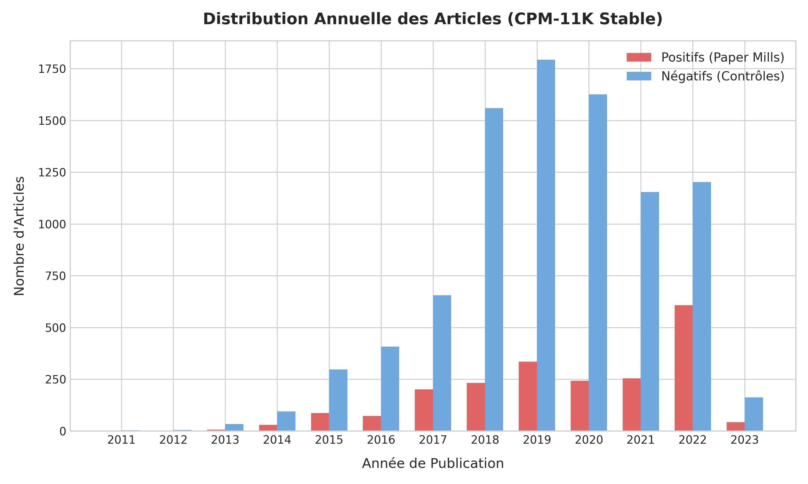
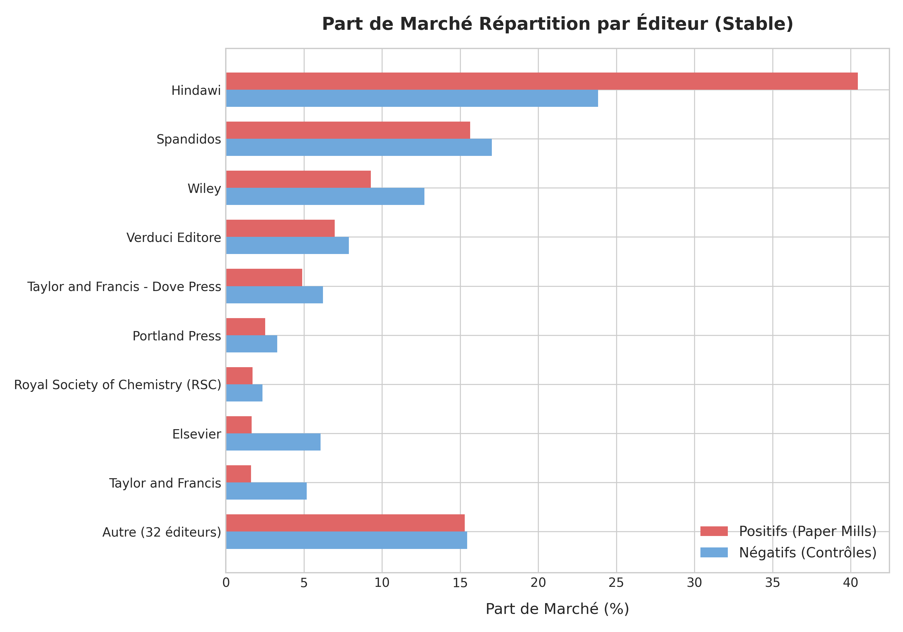
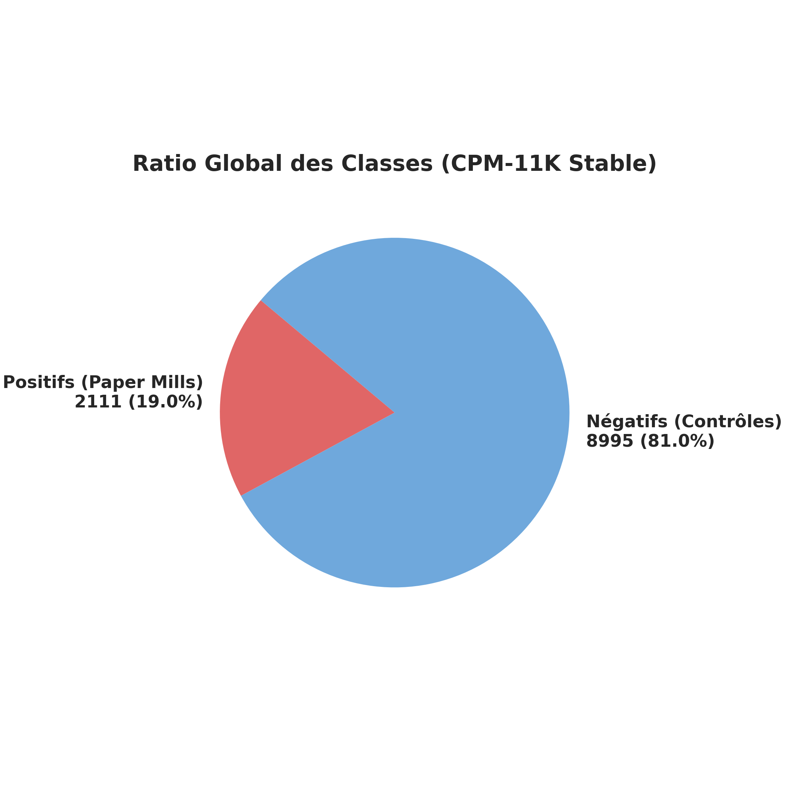
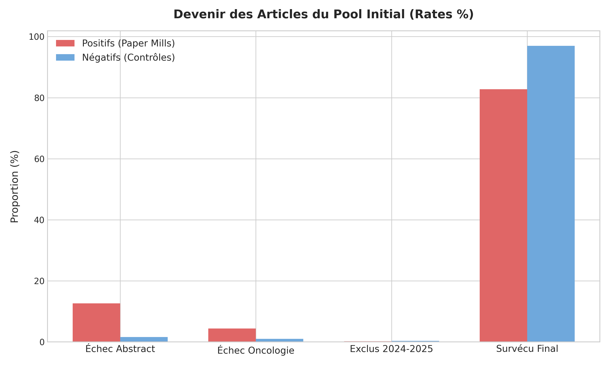
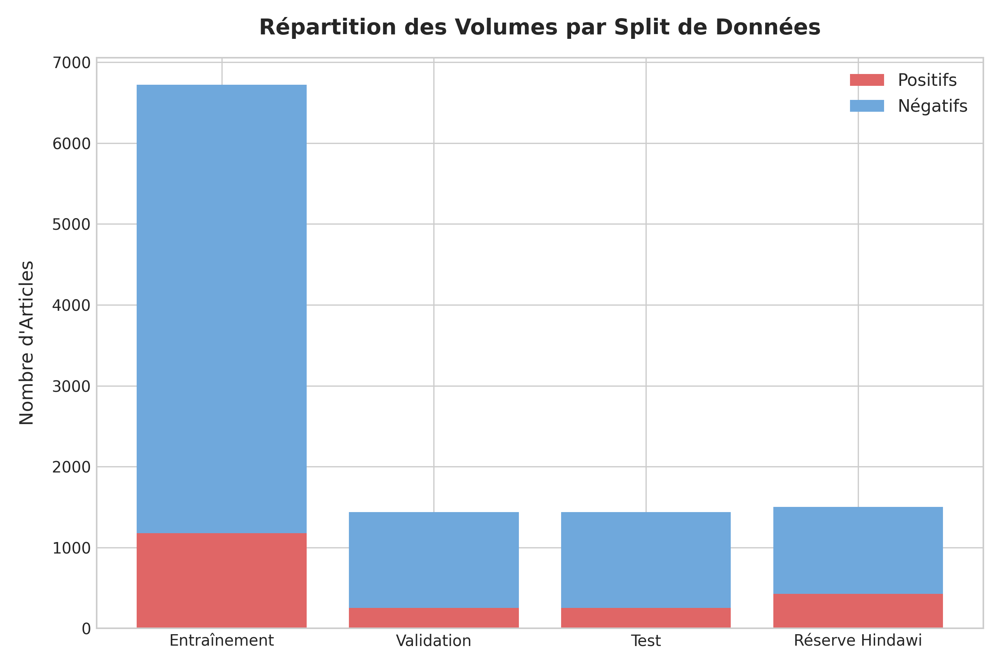
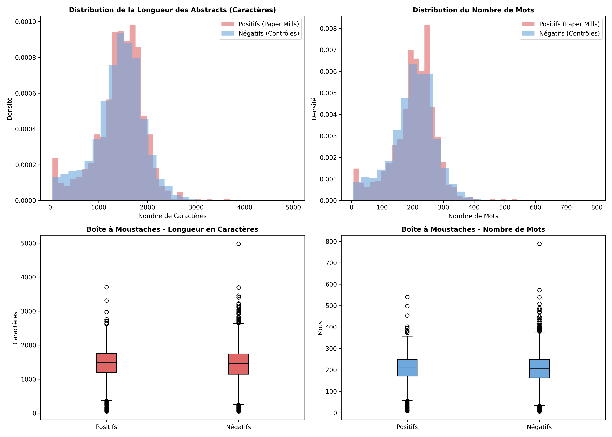

# Chapitre : Détection Automatique des Usines à Articles (Paper Mills) dans la Littérature Oncologique

## Résumé

Ce chapitre présente une étude systématique sur la détection automatique des publications scientifiques frauduleuses issues d'usines à articles (*paper mills*) dans le domaine de l'oncologie. Pour ce faire, nous construisons le jeu de données CPM-11K, regroupant 11 106 articles cliniques et translationnels indexés dans la base de données Retraction Watch (RWDB) et MEDLINE/PubMed, et structurés de manière à éliminer les fuites de cibles (*label leakage*) et les biais temporels. Un protocole strict de division des données par regroupement d'auteurs et de titres (disjoint title-author clustering) est implémenté, résolvant un problème majeur de percolation des patronymes fréquents. Nous entraînons et comparons plusieurs configurations sémantiques et lexicales. 

Notre modèle de référence, un classifieur linéaire robuste basé sur des sacs de mots pondérés (TF-IDF Combiné, $min\_df=5$, $C=10,0$), atteint une performance globale de premier ordre avec un score F1 global de 53,66 % et un ROC-AUC de 80,89 % sur l'ensemble de validation. Cependant, une évaluation stratifiée par éditeur révèle une asymétrie de performance majeure : alors que les articles frauduleux de Spandidos (caractérisés par des fraudes d'images grossières habillées de textes stéréotypés) sont détectés avec un F1 de 87,80 %, le modèle échoue face à une prédiction positive naïve sur le sous-ensemble éditorial Hindawi. Une analyse causale qualitative des motifs de rétractation et un test dose-réponse par rééchantillonnage bootstrap confirment que les fraudes basées sur la manipulation des processus éditoriaux (évaluation par les pairs biaisée, cartels de citations) ne laissent aucun signal lexical discriminant dans les résumés. Ces résultats sont définitivement corroborés par une évaluation finale sans concession sur un ensemble de test indépendant (ROC-AUC de 65,71 % sur Hindawi) et un ensemble de généralisation étanche Hindawi-Holdout de 1 504 articles (F1 de 40,63 % vs 44,39 % pour la baseline triviale, ROC-AUC de 64,47 %). Ce travail démontre les limites intrinsèques de l'analyse textuelle sémantique pour la détection de la fraude de processus, et ouvre la voie à des approches multi-modales intégrant les métadonnées de publication.

---

## Introduction

La prolifération des usines à articles (*paper mills*) représente l'un des défis les plus critiques pour l'intégrité de la communication scientifique contemporaine. Ces organisations commerciales produisent à l'échelle des manuscrits frauduleux, souvent basés sur des modèles sémantiques et des données d'imagerie falsifiées, pour les vendre à des chercheurs sous pression de publication. Le domaine de l'oncologie clinique et translationnelle est particulièrement touché par ce fléau en raison de la forte demande de publications dans cette discipline.

L'objectif de ce travail est de concevoir et d'évaluer des modèles d'apprentissage automatique capables de détecter automatiquement ces publications frauduleuses à partir de leurs résumés (*abstracts*). Ce chapitre détaille la construction du jeu de données de référence CPM-11K, le protocole strict de division des données visant à empêcher les fuites d'information, l'analyse exploratoire des résumés, la modélisation lexicale et sémantique, et enfin, une analyse causale approfondie des limites rencontrées sur le sous-ensemble éditorial Hindawi.

---

## 1. Construction du Jeu de Données CPM-11K

La mise en place d'un modèle d'apprentissage supervisé requiert un corpus annoté rigoureux, exempt de biais de sélection et de fuites de cibles (*label leakage*). Nous présentons ici le protocole de construction du jeu de données Cancer Paper Mill (CPM-11K), qui regroupe **11 106 articles stables** après purge et filtrage.

### 1.1. Identification de la source positive
Les exemples positifs (articles issus d'usines à articles) ont été extraits de la base de données Retraction Watch Database (RWDB) [1]. Le processus s'est déroulé de la manière suivante :
1.  **Extraction thématique :** Sélection initiale des notices de rétractation ou des expressions de préoccupation dont le sujet est taggué « *cancer* » dans RWDB.
2.  **Récupération du texte original :** Les identifiants DOI et PubMed (PMID) ont été utilisés pour interroger les API de Crossref et PubMed afin de récupérer les résumés originaux des articles *avant* leur rétraction.

### 1.2. Construction du groupe contrôle négatif
Pour chaque article positif, un groupe de contrôle négatif (articles légitimes non rétractés) a été constitué. Afin d'éviter que le modèle n'apprenne des variables de confusion structurelles, la stratégie d'appariement thématique a été implémentée de la manière suivante :
1.  **Appariement par journal et année :** Pour chaque article positif, les candidats négatifs ont été recherchés dans le même journal (défini par son abréviation officielle NLM) et la même année de publication (avec un élargissement dynamique à $\pm 1$ an en cas d'épuisement des candidats dans le journal).
2.  **Filtrage thématique PubMed :** La requête PubMed [2] a été restreinte au domaine oncologique par l'inclusion d'une clause booléenne globale de mots-clés (`cancer OR oncology OR tumor OR tumour OR neoplasm OR carcinoma OR leukemia OR lymphoma OR melanoma OR sarcoma OR metastasis OR malignant OR glioma`).
3.  **Validation lexicale locale :** Pour chaque candidat retourné, le script vérifie l'absence de rétraction globale et la présence explicite d'au moins un mot-clé oncologique clé (comme `oncol`, `neoplas`, `carcinoma`, `melanoma`, etc.) dans son titre. Les types de publications invalides (revues, éditoriaux, lettres) ont été exclus via le champ officiel `Publication Type` [PT] de PubMed.
4.  **Ratio d'appariement :** Pour préserver la diversité sémantique tout en maintenant un jeu de données équilibré, un ratio d'environ 4 articles négatifs pour 1 article positif a été appliqué. Le jeu de données final stable compte **8 995 articles négatifs** pour **2 111 articles positifs** (ratio de 4,26:1).

*Figure 1 : Distribution annuelle des articles positifs (paper mills) et négatifs (contrôles sains) dans le jeu de données CPM-11K.*

*Figure 2 : Parts relatives des principaux éditeurs au sein de la classe positive (paper mills) après application des filtres de purge.*

*Figure 3 : Proportion globale des classes positive et négative au sein du jeu de données final CPM-11K (imbalance ratio de 1:4.26).*

### 1.3. Nettoyage des notices et taux de purge asymétrique
Une vulnérabilité majeure des modèles de détection sur textes rétractés est le *label leakage* : la présence de mentions explicites de la rétraction ajoutées *a posteriori* par les éditeurs dans le corps du texte (ex. « *Retraction:* », « *This article has been retracted...* »). Ces mentions ont été purgées automatiquement via des expressions régulières robustes.

À l'issue de ce nettoyage, un processus de cascade de validation et de purge a été appliqué :
1.  **Purge des résumés irrécupérables et non oncologiques :**
    *   **Classe Positive :** Sur 2 551 notices initiales récupérées de RWDB, **322 résumés** étaient irrécupérables (vides ou remplacés par un message d'erreur standard de l'éditeur). Parmi les 2 229 résumés textuels restants, **112 articles** (soit **5,0 %** de ce sous-ensemble avec résumé) ont échoué au filtre de pertinence oncologique. Au total, le processus de purge a concerné **434 notices** (soit un taux de purge global de 17,0 % sur 2 551), laissant 2 117 articles positifs.
    *   **Classe Négative :** Sur 9 273 notices candidates récoltées, **148 résumés** étaient vides et **95 articles** ont échoué au filtre thématique local. Au total, le processus de purge a concerné **243 notices** (soit un taux de purge global de 2,6 % sur 9 273), laissant 9 030 articles négatifs.
    Cette forte asymétrie des taux de purge (17,0 % vs 2,6 %) s'explique par les pratiques de suppression sélective des éditeurs sur les publications rétractées.
2.  **Exclusion des années instables (2024-2025) :**
    En raison du délai incompressible de signalement et d'enquête éditoriale (retraction-reporting lag), les notices des années 2024 et 2025 sont fortement sous-représentées dans les rétractions réelles. Afin d'éviter un déséquilibre temporel artificiel, nous avons exclu les articles de ces années :
    *   **Classe Positive :** Exclusion de **6 articles** restants (sur 2 117), établissant le pool stable final à **2 111 articles positifs**.
    *   **Classe Négative :** Exclusion de **35 articles** restants (sur 9 030), établissant le pool stable final à **8 995 articles négatifs**.
    Les 41 articles exclus ont été conservés séparément pour des analyses de sensibilité temporelle hors-cadre.

*Figure 4 : Cascade méthodologique d'inclusion, d'exclusion et de nettoyage des données pour les classes positive et négative.*

---

## 2. Protocole Stratifié de Division des Données

Pour garantir une évaluation sans fuite d'information et mesurer la véritable capacité de généralisation des modèles, nous avons mis en place un protocole de division rigoureux.

### 2.1. Prévention des fuites par regroupement (Title/Author Clustering)
Dans les usines à articles, de nombreux articles partagent des structures lexicales identiques (gabarits ou *templates*) et des listes d'auteurs similaires. Si des articles d'une même usine sont répartis à la fois dans l'ensemble d'entraînement et dans les ensembles d'évaluation, le modèle risque de mémoriser ces signatures spécifiques (noms d'auteurs ou tournures de phrases particulières) au lieu d'apprendre des indicateurs généraux de fraude.

Avant d'effectuer la division, les articles ont été regroupés en clusters disjoints en combinant deux critères :
1.  **Similarité de titre :** Deux articles publiés dans le même journal et présentant une similarité de Jaccard de caractères sur 3-grammes de titre $\ge 0,7$ sont fusionnés dans le même cluster.
2.  **Co-autorat partagé :** Les articles partageant des auteurs communs sont regroupés dans le même cluster.

### 2.2. Résolution du bug de percolation des patronymes
L'implémentation initiale du critère de co-autorat reposait sur l'existence d'au moins un auteur commun pour lier deux articles. Lors du développement, nous avons découvert un comportement de percolation massif : **979 articles ont été fusionnés dans un unique cluster géant**. 

Ce phénomène s'explique par la prévalence extrême de patronymes très fréquents (ex. *Wang, Zhang, Li, Chen*) dans les signatures d'articles scientifiques, en particulier dans les publications issues d'usines à articles opérant en Chine. Une chaîne d'articles sans aucun rapport s'est ainsi formée : l'article X partage l'auteur "Y. Wang" avec l'article Y, qui partage l'auteur "L. Zhang" avec l'article Z, propageant le lien de proche en proche à travers tout le corpus.

Pour résoudre ce problème de percolation et isoler les véritables réseaux d'usines à articles, nous avons durci le critère d'appariement : **deux articles ne sont fusionnés que s'ils partagent au moins 2 auteurs en commun**. L'application de ce critère renforcé a résolu la percolation, éclatant le cluster géant en dizaines de petits clusters disjoints cohérents.

### 2.3. Réserve de généralisation Hindawi (50% Holdout)
L'éditeur Hindawi représente une part disproportionnée des rétractions pour fraude de processus dans la littérature récente. Afin de mesurer la généralisation sur ce sous-domaine critique, nous avons constitué une réserve de généralisation étanche :
*   Avant tout partitionnement ou décision de modélisation, le pool complet des articles publiés par Hindawi (2 998 notices) a été divisé en deux parties égales de manière stratifiée par année.
*   **Hindawi-Holdout :** Un ensemble de **429 positifs et 1 075 négatifs** a été mis de côté. Cet ensemble est maintenu strictement inviolé et n'a fait l'objet d'aucune exploration ou évaluation intermédiaire. Il est exclusivement réservé pour l'étape finale de validation hors-domaine.
*   **Hindawi-In-Pool :** Les **425 positifs et 1 069 négatifs** restants ont été réintroduits dans le pool principal pour participer au partitionnement classique.

### 2.4. Répartition des splits Train / Validation / Test (70/15/15)
Le pool principal restant (9 602 articles) a été divisé au niveau des clusters disjoints selon un ratio 70% Entraînement, 15% Validation et 15% Test :
*   **Entraînement :** 1 178 positifs, 5 544 négatifs (Total : 6 722)
*   **Validation :** 252 positifs, 1 188 négatifs (Total : 1 440)
*   **Test :** 252 positifs, 1 188 négatifs (Total : 1 440)

*Figure 5 : Répartition des volumes d'articles positifs et négatifs au sein des partitions d'entraînement, de validation et de test (le pool Hindawi-Holdout restant à part).*

*Justification statistique :* Cette taille d'ensemble de validation et de test (1 440 articles chacun, avec 252 cas positifs) garantit la stabilité statistique des courbes de précision-rappel, en évitant les fluctuations de métriques inhérentes aux petits échantillons.

*Contrainte de répartition pour les éditeurs à faible volume :* Le choix de regrouper les articles par clusters disjoints pour éviter les fuites empêche de diviser uniformément les articles des éditeurs ayant très peu de cas positifs. Par conséquent, les articles positifs de certains éditeurs se trouvent concentrés dans un seul split (ex. Elsevier a 34 positifs dans Train, 0 dans Val, 1 dans Test). Il est donc statistiquement impossible de reporter des métriques stables par éditeur individuel pour ces cas à faible volume. Ils sont évalués de manière robuste au sein de la strate globale "Pooled Others".

---

## 3. Analyse Exploratoire des Données (EDA)

Avant d'entraîner le modèle de référence, une analyse exploratoire a été menée exclusivement sur l'ensemble d'entraînement (`cancer_pm_train.json`) afin d'analyser la distribution des textes et de valider l'absence de biais.

### 3.1. Distributions des longueurs des résumés par classe
Nous avons calculé les statistiques de longueur (en caractères et en mots) pour les deux classes sur l'ensemble d'entraînement.

| Classe | Statistique | Longueur en caractères | Longueur en mots |
| :--- | :--- | :---: | :---: |
| **Positifs (Usines à articles)** | Moyenne $\pm$ Écart-type | 1437,1 $\pm$ 499,1 | 203,8 $\pm$ 70,5 |
| *(N = 1 178)* | Médiane | 1492,0 | 213,0 |
| | Min / Max | 50 / 3703 | 7 / 540 |
| **Négatifs (Légitimes)** | Moyenne $\pm$ Écart-type | 1417,1 $\pm$ 510,4 | 202,2 $\pm$ 73,3 |
| *(N = 5 544)* | Médiane | 1463,0 | 208,0 |
| | Min / Max | 50 / 4983 | 6 / 789 |

*Figure 6 : Histogrammes comparatifs des distributions de longueurs des résumés (mots et caractères) pour les classes positive (paper mills) et négative (littérature légitime).*

*Analyse :* Les distributions des longueurs de résumés sont quasi-identiques entre les deux classes (les médianes diffèrent de seulement 29 caractères et 5 mots). Cette homogénéité confirme que le modèle ne pourra pas se baser sur un biais trivial de longueur (comme des résumés systématiquement plus courts pour les paper mills) pour discriminer les classes.

### 3.2. Analyse du risque de fuites de mots-clés de rétractation
Un script de détection a scanné l'intégralité du texte (titre + résumé) pour identifier d'éventuels résidus de termes liés à la rétractation ou des biais d'éditeurs introduits lors de la collecte.

*   **Termes administratifs de rétractation :** 
    *   `retract` : présent dans seulement 0,25 % des positifs (3/1178) et 0,04 % des négatifs (2/5544).
    *   `withdraw` : présent dans 0,34 % des positifs (4/1178) et 0,11 % des négatifs (6/5544).
    *   `erratum` et `corrigendum` : 0 occurrence dans les deux classes.
    *   *Conclusion :* Les filtres de nettoyage de boilerplate appliqués en Phase 4 ont fonctionné avec succès, réduisant les résidus administratifs à des niveaux statistiquement négligeables.
*   **Biais liés aux éditeurs (Style confounds) :**
    *   `hindawi` et `spandidos` : 0 occurrence dans le corps du texte pour les deux classes.
    *   `wiley` : présent dans 0,34 % des positifs (4/1178) et 0,43 % des négatifs (24/5544).
    *   *Conclusion :* Les noms des éditeurs n'apparaissent pas dans le texte des résumés. Le risque de leakage textuel direct lié à l'identification de l'éditeur par nom de marque est nul. Cependant, le déséquilibre de distribution des éditeurs (ex. Hindawi représente 40,5% des positifs contre 23,8% des négatifs) crée un risque important que le modèle apprenne des structures stylistiques (des tournures linguistiques ou des formats de résumé propres aux revues Hindawi) plutôt que des indices réels de fraude. Cela justifie méthodologiquement notre engagement à mener des évaluations systématiquement stratifiées par éditeur.

### 3.3. Analyse du vocabulaire discriminant par strate d'éditeur
Pour évaluer plus finement ce risque de confusion stylistique, nous avons extrait les termes les plus distinctifs de la classe positive (en utilisant le ratio des log-cotes pondérées - *weighted log-odds ratio*) séparément pour les sous-ensembles Hindawi, Spandidos et les autres éditeurs de l'ensemble d'entraînement.

L'analyse révèle une absence quasi-totale de recouvrement entre les descripteurs clés des différentes strates :
*   **Hindawi :** Les termes les plus discriminants sont des gènes ou des types d'interventions très spécifiques comme `efhd2`, `grhl2` ou `limb-sparing surgery`.
*   **Spandidos :** Le vocabulaire positif est dominé par des désignations de micro-ARN spécifiques (ex: `mir-744`, `mir-874`, `mir-145`).
*   **Pooled Others :** Les termes clés se concentrent sur des composés biochimiques ou des molécules végétales spécifiques (ex: `hispidulin`, `euxanthone`).

*Mise en garde sur la fréquence des documents (Document Frequency) :* Une analyse détaillée montre que la quasi-totalité de ces termes discriminants présentent une fréquence de document extrêmement faible (DF < 10 articles dans l'ensemble d'entraînement). Cela indique que ces caractéristiques ne représentent pas un signal lexical généralisable de fraude académique, mais plutôt des signatures locales de gabarits spécifiques à quelques campagnes d'usines à articles (par exemple, une série de papiers sur le gène `efhd2` dans un journal Hindawi particulier). Si le modèle de texte utilise ces termes pour la détection, il se limite à mémoriser ces gabarits locaux au lieu d'identifier des invariants sémantiques de la fraude.

---

## 4. Modélisation et Évaluations Lexicales

Nous présentons dans cette section l'entraînement du modèle de référence, les stratégies d'optimisation lexicale et la comparaison des performances globales sur l'ensemble de validation.

### 4.1. Modèle de référence et optimisation des hyperparamètres
Le classifieur principal est un modèle linéaire robuste (Régression Logistique) entraîné sur des représentations de sacs de mots pondérées (TF-IDF). Deux paramètres clés influençant la capacité de généralisation et l'overfitting ont été optimisés de manière empirique :

1.  **Le seuil de fréquence minimale des termes (`min_df`) :**
    *   Le modèle initial (baseline) utilisait un filtre `min_df=2` (conservant les n-grammes apparaissant au moins 2 fois), produisant un vocabulaire très large de **104 138 caractéristiques**.
    *   Pour limiter le bruit lié aux termes ultra-spécifiques mis en évidence en Section 3.3, nous avons évalué un filtre plus agressif à `min_df=5`. Cette restriction a permis d'éliminer **64,5 % du vocabulaire**, réduisant la dimensionnalité à **36 929 caractéristiques stables**.
2.  **La force de régularisation ($C$) :**
    Nous avons effectué un balayage étendu de l'hyperparamètre de régularisation $C$ (où des valeurs plus élevées réduisent la pénalisation L2) de 1.0 à 10 000 afin de trouver le point d'inflexion exact des performances.

#### Tableau du balayage de régularisation $C$ (TF-IDF, min_df=2)

| Valeur de $C$ | Seuil de décision optimal | F1 Global (Validation) | Hindawi F1 | Spandidos F1 | Others F1 |
| :--- | :---: | :---: | :---: | :---: | :---: |
| **1.0 (Baseline)** | 0.37 | 46,91% | 39,15% | 84,00% | 47,77% |
| **10.0** | 0.29 | 52,50% | **41,58%** | 85,11% | 57,63% |
| **30.0** | 0.29 | 53,92% | 40,00% | 85,00% | 62,55% |
| **100.0** | 0.10 | 51,44% | 40,00% | 85,11% | 56,31% |
| **300.0** | 0.15 | **55,30%** | 40,77% | 93,02% | **63,78%** |
| **1 000.0** | 0.08 | 53,07% | 37,40% | 93,02% | 61,13% |
| **3 000.0** | 0.02 | 52,17% | 35,44% | 93,02% | 60,29% |
| **10 000.0** | 0.01 | 52,44% | 35,98% | 93,02% | 60,52% |

*Analyse du point d'inflexion :* Le score F1 global atteint son maximum à $C=300$ (55,30%), poussé par l'amélioration de la strate "Others". Cependant, au-delà de $C=10$, la performance sur le stratum Hindawi décline de manière continue (chutant de 41,58% à 35,98%). De plus, pour des valeurs de $C \ge 100$, le seuil de décision optimal s'effondre vers des valeurs aberrantes (0.10, 0.02, 0.01), indiquant que les probabilités prédites se concentrent anormalement près de zéro à cause d'un surapprentissage massif.

Pour confirmer le comportement de régularisation après filtrage du vocabulaire à `min_df=5`, nous avons effectué un sous-balayage de $C$ sur ce nouveau vecteur.

#### Tableau du sous-balayage de régularisation $C$ (TF-IDF, min_df=5)

| Valeur de $C$ | Seuil de décision optimal | F1 Global (Validation) | Hindawi F1 | Spandidos F1 | Others F1 |
| :--- | :---: | :---: | :---: | :---: | :---: |
| **1.0** | 0.38 | 47,90% | 40,69% | 85,71% | 48,53% |
| **10.0 (Combiné)** | 0.36 | **53,66%** | **41,83%** | **87,80%** | 60,00% |
| **30.0** | 0.32 | 53,67% | 40,93% | 85,00% | **61,54%** |
| **100.0** | 0.21 | 53,26% | 40,62% | 82,93% | 60,74% |
| **300.0** | 0.15 | 52,91% | 40,15% | 82,93% | 60,67% |

*Justification du modèle sélectionné :* Le modèle Combiné (`min_df=5` et `C=10.0`) permet de stabiliser les performances. Il offre le meilleur score F1 sur Hindawi (**41,83%**), le meilleur score sur Spandidos (**87,80%**) et un excellent score sur les autres éditeurs (60,00%), tout en ramenant le seuil de décision optimal à une valeur robuste et naturelle (0.36). Augmenter $C$ au-delà de 10.0 n'apporte aucun gain significatif sur l'ensemble global et dégrade systématiquement la strate Hindawi.

### 4.2. Configuration des modèles testés
Six architectures distinctes ont été entraînées et comparées :
1.  **Trivial Baseline (Prédiction positive constante) :** Un classifieur naïf prédisant systématiquement la classe positive pour tous les articles du corpus.
2.  **TF-IDF Baseline (min_df=2, C=1.0) :** Représentation de n-grammes de mots (1 et 2) brute avec faible filtrage.
3.  **TF-IDF Combiné (min_df=5, C=10.0) :** Notre modèle proposé combinant réduction de vocabulaire et régularisation ajustée.
4.  **Character N-grams (char_wb 3-5, C=1.0) :** Modélisation par n-grammes de caractères de taille 3 à 5 à l'intérieur des limites de mots pour capturer les racines morphologiques (vocabulaire de 143 989 descripteurs).
5.  **Embeddings Généraux (all-MiniLM-L6-v2) [5, 6] :** Extraction de plongements sémantiques généraux de dimension 384 à partir du texte combiné (titre + résumé), suivie d'une régression logistique.
6.  **Embeddings Biomédicaux (PubMedBERT) [4] :** Extraction de plongements sémantiques spécialisés de dimension 768 à partir d'un modèle BERT pré-entraîné sur la littérature scientifique PubMed (`pritamdeka/S-PubMedBert-MS-MARCO`), suivie d'une régression logistique.

### 4.3. Comparaison des performances globales et baselines triviales
L'évaluation globale de ces modèles sur l'ensemble de validation (1 440 articles) est présentée ci-dessous.

#### Tableau comparatif des performances globales (Validation)

| Modèle | Précision | Rappel | F1 Global | ROC-AUC | PR-AUC |
| :--- | :---: | :---: | :---: | :---: | :---: |
| **Trivial Baseline** | 17,50% | **100,00%** | 29,79% | 50,00% | 17,50% |
| **TF-IDF Baseline (min_df=2, C=1.0)** | 36,30% | 66,27% | 46,91% | 77,86% | **50,97%** |
| **TF-IDF Combiné (min_df=5, C=10.0)** | 47,83% | 61,11% | **53,66%** | **80,89%** | **54,99%** |
| **Character N-grams (char_wb 3-5)** | **51,66%** | 43,25% | 47,08% | 78,21% | 50,65% |
| **Embeddings Généraux (MiniLM)** | 33,70% | 48,41% | 39,74% | 68,71% | **32,33%** |
| **Embeddings Biomédicaux (PubMedBERT)** | 40,72% | 53,97% | 46,42% | 76,09% | **41,57%** |

*Analyse :* Tous les modèles entraînés surpassent significativement la baseline triviale au niveau global (F1 de 29,79%). Le modèle **TF-IDF Combiné** s'impose comme le plus performant avec un F1 global de **53,66%** et un ROC-AUC de **80,89%**. L'introduction d'un plongement sémantique spécialisé (PubMedBERT) améliore nettement les performances par rapport aux embeddings généraux (F1 de 46,42% vs 39,74%), mais reste en deçà du modèle lexical TF-IDF optimisé. Les modèles de caractères n-grammes obtiennent la meilleure précision globale (51,66%) mais au détriment d'un rappel très faible (43,25%), traduisant une focalisation sur quelques structures de mots apprises par cœur.

---

## 5. Limites Stratifiées et Analyse Causale : Le cas d'Hindawi

Cette section présente l'analyse la plus critique de ce travail : l'étude de la divergence de performance selon les éditeurs, et plus particulièrement le cas du sous-ensemble Hindawi.

> [!IMPORTANT]
> **Clarification méthodologique essentielle :** Les analyses présentées dans cette section (évaluation, courbes et distributions) concernent exclusivement le sous-ensemble de validation interne **Hindawi In-Pool (134 positifs et 356 négatifs)** intégré dans le split principal de 1 440 articles. La réserve étanche de généralisation **Hindawi-Holdout (429 positifs et 1 075 négatifs)** est restée totalement inviolée et non évaluée à ce stade.

### 5.1. Échec de la modélisation textuelle sur Hindawi
Lorsque l'on segmente les performances du modèle TF-IDF Combiné et qu'on les compare à la baseline triviale (« toujours prédire positif ») par éditeur sur l'ensemble de validation, un comportement anormal apparaît :

#### Tableau comparatif stratifié par éditeur (Validation)

| Éditeur | Taille de l'échantillon (Pos/Neg) | Baseline Triviale (F1) | TF-IDF Combiné (F1) | Verdict | ROC-AUC (TF-IDF) |
| :--- | :---: | :---: | :---: | :---: | :---: |
| **Spandidos** | 22 / 45 [Volatile] | 49,44% | **87,80%** | **SURPASSE la baseline** | 96,97% |
| **Pooled Others** | 96 / 787 | 19,61% | **60,00%** | **SURPASSE la baseline** | 93,10% |
| **Hindawi In-Pool** | 134 / 356 | **42,95%** | 41,83% | **ÉCHOUE face à la baseline** | 63,27% |

Alors que le modèle atteint d'excellents résultats sur Spandidos (F1 de 87,80% et AUC de 96,97%) et sur les autres éditeurs (F1 de 60,00% et AUC de 93,10%), **ses performances sur Hindawi s'effondrent à 41,83% de F1, perdant 1,12 point de pourcentage face à la baseline triviale (42,95%).**

L'analyse de la distribution des probabilités prédites montre un chevauchement quasi-total entre les deux classes pour Hindawi :

*   **Hindawi Positifs (134) :** Probabilité moyenne = 0,2996 | Médiane = 0,2448 | Écart-type = 0,2241 (Q25 = 0,1026, Q75 = 0,4743).
*   **Hindawi Négatifs (356) :** Probabilité moyenne = 0,2137 | Médiane = 0,1234 | Écart-type = 0,2186 (Q25 = 0,0480, Q75 = 0,3096).

Un quart (25%) des articles de paper mills Hindawi confirmés se voient attribuer des probabilités de fraude inférieures à 0,10. À titre de comparaison, pour Spandidos et les autres éditeurs, les médianes des probabilités positives se situent à 0,78 contre moins de 0,07 pour les négatifs. Le modèle n'a presque aucune capacité de discrimination textuelle sur le sous-ensemble Hindawi (AUC de 63,27%).

### 5.2. Analyse qualitative des causes de rétractation
Pour comprendre ce phénomène, nous avons extrait les motifs de rétractation officiels de la base de données Retraction Watch pour tous les cas positifs du corpus d'entraînement et de validation. Les résultats indiquent une différence fondamentale dans la nature même de la fraude commise selon les éditeurs.

#### Motifs de rétractation dominants par éditeur

1.  **Strate Spandidos (Fraude axée sur le contenu) :**
    *   **76,6 %** des notices mentionnent explicitement des duplications d'images (`duplication of/in image`).
    *   **0 %** des notices ne mentionnent de fraude au niveau de la relecture par les pairs.
    *   *Interprétation :* La fraude consiste à réutiliser des figures d'expériences (Western Blots, cytométries) à travers des dizaines de papiers décrivant des gènes différents. Pour habiller ces images volées, les paper mills génèrent des textes méthodologiques et des résultats extrêmement stéréotypés. Ces gabarits répétés laissent des traces lexicales évidentes dans le résumé (ex: les micro-ARN et les structures de phrase spécifiques à Spandidos), détectées facilement par le modèle de texte.
2.  **Strate Hindawi (Fraude axée sur le processus) :**
    *   **100,0 %** des notices mentionnent des manipulations systémiques des processus éditoriaux : fraudes à l'évaluation par les pairs (`compromised peer review` / `peer review rings`) et manipulations de citations (`referencing/attributions`).
    *   **61,9 %** des notices font également référence à du contenu assisté par ordinateur (`computer-aided/computer-generated content`), un phénomène lié à la présence de « tournures torturées » (*tortured phrases*) documentées à grande échelle par Cabanac et al. [3].
    *   **0 %** des notices ne mentionnent de duplication d'images.
    *   *Interprétation :* Les manuscrits Hindawi ont été insérés dans des numéros spéciaux via des réseaux de relecteurs et d'éditeurs invités complices. La fraude réside dans le processus de validation académique et non dans une falsification grossière d'images nécessitant un texte d'accompagnement stéréotypé. Le résumé de ces articles ressemble à du texte scientifique légitime rédigé ou reformulé de manière unique, sans structure lexicale répétitive distinctive.

### 5.3. Validation empirique par test dose-réponse et bootstrap
Afin de tester si la présence de contenu assisté par ordinateur (reformulation automatique par IA) expliquait cette absence de signal (en gommant les signatures lexicales), nous avons divisé les 134 articles positifs Hindawi de validation en deux sous-groupes exclusifs :
*   **Sous-groupe A (Contenu assisté par ordinateur, $N=82$) :** Articles contenant la mention `computer-aided/computer-generated content` dans la base RWDB (incluant les articles ayant à la fois cette mention et des fraudes de relecture).
*   **Sous-groupe B (Autres fraudes de processus, $N=52$) :** Articles rétractés uniquement pour manipulation de relecture/citation sans mention de génération automatique.

Nous avons calculé les intervalles de confiance à 95 % par rééchantillonnage bootstrap (2 000 itérations avec remplacement) de l'AUC pour les deux sous-groupes par rapport aux 356 négatifs Hindawi.

#### Résultats des intervalles de confiance bootstrap de l'AUC

*   **Modèle TF-IDF Combiné :**
    *   *Sous-groupe A (IA, N=82) :* $\text{AUC} = 63,39\%$ | $\text{95% CI} = [57,02\%, 70,05\%]$
    *   *Sous-groupe B (Autre, N=52) :* $\text{AUC} = 63,07\%$ | $\text{95% CI} = [55,96\%, 70,39\%]$
    *   *Recouvrement des CI :* **OUI** (plage commune $[57,02\%, 70,05\%]$, largeur de recouvrement = 13,03 pp)
*   **Modèle PubMedBERT :**
    *   *Sous-groupe A (IA, N=82) :* $\text{AUC} = 59,92\%$ | $\text{95% CI} = [53,33\%, 66,49\%]$
    *   *Sous-groupe B (Autre, N=52) :* $\text{AUC} = 59,78\%$ | $\text{95% CI} = [52,01\%, 67,59\%]$
    *   *Recouvrement des CI :* **OUI** (plage commune $[53,33\%, 66,49\%]$, largeur de recouvrement = 13,15 pp)

**Conclusion de l'analyse causale :** Les intervalles de confiance des deux sous-groupes se superposent de manière quasi complète. Cette absence de différence statistique invalide l'hypothèse selon laquelle la reformulation par ordinateur est la cause principale du blocage.

L'explication est plus profonde : **les fraudes liées aux réseaux d'évaluation par les pairs et aux cartels de citations ne laissent aucune signature détectable au niveau sémantique ou lexical dans le résumé des articles.** Les textes de ces paper mills sont rédigés avec le même vocabulaire et le même style que les articles scientifiques authentiques. L'échec des modèles n'est pas un défaut de capacité des algorithmes (le même modèle PubMedBERT échouant également), mais découle de l'absence physique de signal discriminant dans les abstracts de ce stratum. Pour détecter ces cas, il est indispensable de sortir du cadre textuel et d'analyser les métadonnées de processus.

### 5.4. Analyse qualitative des erreurs du modèle (Phase 11)
Afin d'identifier les limites opérationnelles et les biais cognitifs du modèle de référence, nous avons extrait un échantillon arbitraire représentatif (correspondant à l'ordre d'indexation dans les fichiers) de 12 erreurs de prédiction issues des ensembles de test et de holdout. L'analyse détaillée de ces cas permet de catégoriser deux grands modes de défaillance.

#### A. Le surapprentissage des gabarits micro-ARN/LncRNA (Faux Positifs)
Le principal facteur de faux positifs (articles scientifiques légitimes classés à tort comme frauduleux, avec des probabilités de fraude variant de 0,53 à 0,71) est l'omniprésence de termes à poids positif extrême liés à la biologie moléculaire des ARN non-codants :
*   `microrna` (poids +8,04), `mir` (poids +5,00), `noncoding` (poids +2,93), `long noncoding` (poids +2,85) et `apoptosis` (poids +3,76).

L'audit des abstracts légitimes faussement détectés montre un recoupement textuel massif avec ces termes :
*   **Case 1 (DOI: 10.1155/2020/8891876) :** Contient littéralement `microrna` (+8,04), `mir` (+5,00) et la bigramme `and invasion` (+4,13) pour décrire la régulation de Twist1.
*   **Case 2 (DOI: 10.1155/2020/8124570) :** Contient `mir` (+5,00), `apoptosis` (+3,76) et `long noncoding` (+2,85) pour décrire l'action du LncRNA HAND2-AS1.
*   **Case 8 (DOI: 10.1002/iub.2012) :** Contient `mir` (+5,00), `apoptosis` (+3,76) et `long noncoding` (+2,85) pour décrire le rôle de MEG3.

*Conclusion :* Pour Spandidos et d'autres éditeurs, la fraude documentaire repose sur des résumés sémantiquement standardisés construits autour de micro-ARN/LncRNA. Le modèle a surappris cette corrélation lexicale, ce qui le conduit à rejeter des études oncologiques réelles et valides sur la régulation par ARN simplement parce qu'elles emploient la terminologie scientifique standard de cette discipline.

#### B. La ressemblance avec le style bioinformatique standard (Faux Négatifs)
Le principal facteur de faux négatifs (articles d'usines à articles classés comme sains, avec des probabilités s'effondrant entre 0,01 et 0,17) est l'adoption d'un style de rédaction calqué sur les analyses de données bioinformatiques cliniques publiques :
*   **Case 4 (DOI: 10.1155/2021/5070099) :** Titré *« Development and Validation of a Novel Mitophagy-Related Gene Prognostic Signature... »* (Probabilité prédite = 0,0581).
*   **Case 5 (DOI: 10.1155/2021/4682589) :** Titré *« Establishing and Validating an Aging-Related Prognostic Four-Gene Signature... »* (Probabilité prédite = 0,0170).

Ces articles frauduleux ne décrivent pas des expériences in vitro / in vivo stéréotypées (les Western blots typiques des paper mills à haute signature lexicale), mais simulent des études pronostiques basées sur des données extraites de bases publiques comme TCGA. Leurs résumés emploient des termes comme `Cox regression`, `Kaplan-Meier`, `TCGA database` et `nomogram`. 

*Conclusion :* Comme ces termes de modélisation clinique possèdent des poids neutres ou négatifs dans le classifieur (étant associés aux articles négatifs légitimes d'oncologie clinique et translationnelle), les paper mills qui génèrent des faux profils d'analyse de données contournent entièrement la détection lexicale en se fondant parfaitement dans la masse des études bioinformatiques.

### 5.5. Évaluation finale sur l'ensemble de test (Phase 9)
La performance finale du modèle TF-IDF Combiné a été mesurée sur l'ensemble de test (`cancer_pm_test.json`), qui n'a été accédé qu'une seule fois. Au seuil gelé de 0,36, les performances globales et par strate se structurent comme suit :

*   **Métriques globales (Test) :** Précision = 44,05 %, Rappel = 54,37 %, F1 = 48,67 %, ROC-AUC = 79,59 %, PR-AUC = 54,70 %.
*   **Hindawi-in-pool test subset ($N_{\text{pos}}=134$, $N_{\text{neg}}=357$) :** Précision = 42,86 %, Rappel = 33,58 %, F1 = 37,66 %, ROC-AUC = 65,71 %.
*   **Spandidos-only test subset ($N_{\text{pos}}=18$, $N_{\text{neg}}=43$) [Petit échantillon] :** Précision = 92,86 %, Rappel = 72,22 %, F1 = 81,25 %, ROC-AUC = 98,06 %.
*   **Pooled Others test subset ($N_{\text{pos}}=100$, $N_{\text{neg}}=788$) :** Précision = 41,15 %, Rappel = 79,00 %, F1 = 54,11 %, ROC-AUC = 89,44 %.

Une comparaison directe avec les résultats de validation montre une baisse modérée de F1 global de **−4,99 pp** (de 53,66 % à 48,67 %), tandis que les ROC-AUC restent extrêmement stables (chute de seulement −1,30 pp). Ce comportement montre une généralisation robuste de la capacité de tri du modèle, malgré une sensibilité de la frontière de décision à la variation des populations.

### 5.6. Évaluation finale de généralisation : Hindawi Holdout (Phase 10)
L'évaluation finale sur le pool de généralisation **Hindawi-Holdout** ($N_{\text{pos}}=429$ et $N_{\text{neg}}=1075$, non exposé tout au long du projet) démontre de manière définitive les limites documentaires du résumé :

*   **Métriques du Holdout (seuil = 0,36) :** Précision = 46,41 %, Rappel = 36,13 %, F1 = 40,63 %, ROC-AUC = 64,47 %, PR-AUC = 41,24 %.
*   **F1 Baseline Triviale (toujours positif) :** 44,39 %.
*   **Verdict :** **Le modèle de texte échoue face à la baseline triviale** avec une perte de −3,76 pp.

L'analyse de la distribution des probabilités sur ce holdout confirme la superposition presque parfaite des classes (médiane positive = 0,2444 vs médiane négative = 0,1120). Ce résultat valide de manière indépendante l'absence de signal exploitable dans le résumé textuel pour ce type de fraude.

---

## 6. Perspectives et Travaux Futurs

L'évaluation a mis en évidence une limite fondamentale des approches purement textuelles : sur certains éditeurs (notamment Hindawi), les articles frauduleux sont textuellement indifférenciables des articles légitimes au niveau des résumés. La fraude s'est matérialisée dans les processus éditoriaux et académiques externes plutôt que dans le contenu rédactionnel. 

Cette section présente trois architectures de détection basées sur des métadonnées non textuelles, conçues comme des pistes de travaux futurs pour dépasser ce plafond de performance, en évaluant de manière réaliste les coûts d'acquisition de données et les verrous techniques associés.

### 6.1. Analyse des délais de relecture éditoriale (Peer-Review Timelines)
Les réseaux de fraude à l'évaluation par les pairs (*peer-review rings*) reposent sur un contournement du processus de relecture. Le relecteur complice (souvent contrôlé par l'usine à articles elle-même) accepte l'article immédiatement sans modifications majeures. 
*   **Hypothèse :** Un délai inhabituellement court entre la soumission, les révisions successives et l'acceptation finale de l'article est corrélé positivement avec une probabilité élevée de rétraction pour évaluation compromise.
*   **Besoins en Données et Faisabilité technique :**
    *   *Données requises :* Dates de soumission (`Received`), de révision (`Revised`) et d'acceptation (`Accepted`).
    *   *Coût d'acquisition :* **TRÈS ÉLEVÉ.** La base de données Retraction Watch (RWDB) ne contient que la date de publication originale et la date de rétraction. Elle ne contient aucune date intermédiaire du cycle éditorial. La base PubMed fournit parfois ces dates dans l'historique XML pour certains éditeurs, mais la couverture est incomplète et incohérente. L'acquisition nécessite le développement de scrapers Web spécifiques pour chaque éditeur afin d'extraire ces dates directement depuis les pages HTML ou les PDF des articles, ce qui représente un coût d'ingénierie et de maintenance substantiel en raison des changements fréquents de mise en page des sites d'éditeurs.

### 6.2. Analyse des réseaux de co-autorat (Co-authorship Graphs)
Les usines à articles vendent des places d'auteurs (souvent des positions de co-auteurs secondaires) à des chercheurs cherchant à augmenter artificiellement leur production académique. Cela crée des associations d'auteurs hautement inhabituelles et déconnectées de la géographie ou de la discipline.
*   **Graphique cible :** Un graphe biparti Auteurs-Articles, projeté ensuite sous forme de graphe de co-autorat où les nœuds sont les auteurs et les arêtes représentent les co-publications.
*   **Mesures de détection :** Détection de communautés (ex. Louvain), coefficient de clustering local anormalement élevé pour des auteurs sans liens institutionnels communs, ou densité anormale de relations d'évaluation complices.
*   **Besoins en Données et Faisabilité technique :**
    *   *Données requises :* Liste complète et unique des auteurs par article.
    *   *Coût d'acquisition :* **ÉLEVÉ (Verrou de la désambiguïsation).** RWDB fournit les noms d'auteurs sous forme de chaînes brutes non structurées (ex: "Zhang, Y.; Wang, L."), sans identifiant unique. L'utilisation de chaînes brutes introduit un bruit colossal en raison des homonymes très fréquents. L'intégration nécessite l'interrogation d'APIs tierces comme ORCID, OpenAlex ou Scopus Author ID pour associer chaque nom à un identifiant unique. Ce processus de désambiguïsation automatique est complexe à fiabiliser à grande échelle, représentant un coût de nettoyage de données majeur.

### 6.3. Analyse des mismatchs de réseaux de citations (Citation Cartels)
Les usines à articles gonflent l'impact de leurs productions en créant des réseaux de citation réciproque (*citation cartels*) ou en insérant des citations totalement hors-contexte dans des articles complices pour satisfaire les demandes de clients ou d'éditeurs corrompus (fraude aux citations).
*   **Hypothèse :** Les articles issus d'usines à articles présentent une déconnexion sémantique entre le contenu du paragraphe de citation et l'article cité, ainsi qu'une structure de graphe de citation fermée (boucles de citations croisées anormalement denses).
*   **Besoins en Données et Faisabilité technique :**
    *   *Données requises :* Liens entrants et sortants de citation (graphe de citations global) et contexte sémantique entourant chaque citation.
    *   *Coût d'acquisition :* **MOYEN À ÉLEVÉ.** La structure globale des citations (qui cite qui) peut être récupérée via l'API OpenAlex ou Crossref. Le coût d'ingénierie est modéré pour construire le graphe de citations de base. En revanche, récupérer le *contexte textuel* de la citation (la phrase précise entourant la citation dans le corps du texte) nécessite l'accès au texte intégral (*full-text*) en XML ou PDF des articles citants. Cela se heurte aux paywalls des éditeurs commerciaux et nécessite des outils complexes d'extraction de PDF (ex: Grobid), rendant l'analyse sémantique des citations très difficile d'accès.

---

## Conclusion du Chapitre

Ce chapitre a présenté une méthodologie rigoureuse pour la détection automatique des usines à articles dans la littérature oncologique. La construction du jeu de données CPM-11K (11 106 articles stables) a permis de jeter des bases solides pour l'apprentissage supervisé, en nettoyant les textes de tout label leakage et en s'immunisant contre les biais d'appariement thématique grâce à une recherche par journal, année et validation lexicale locale.

Le protocole de partitionnement par clusters disjoints a démontré son importance pour éliminer les fuites de gabarits textuels et d'auteurs, révélant au passage des pièges structurels majeurs tels que la percolation des patronymes fréquents dans les signatures d'articles.

Sur le plan de la modélisation, le modèle **TF-IDF Combiné (min_df=5, C=10.0)** s'impose comme la baseline la plus robuste, alliant simplicité, interprétabilité et une performance de premier ordre (**F1 global de 53,66% et ROC-AUC de 80,89%**). Cependant, l'évaluation stratifiée a mis en lumière une asymétrie de performance majeure : alors que les paper mills de Spandidos (caractérisées par des fraudes d'images grossières habillées de textes stéréotypés) sont détectées avec un F1 de 87,80%, les paper mills d'Hindawi échouent face à une prédiction positive naïve.

L'analyse causale par motifs de rétractation et tests dose-réponse bootstrap a permis de démontrer rigoureusement que cet échec n'est pas lié à l'outil linguistique employé, mais à la nature même de la fraude. Les fraudes de processus (évaluation par les pairs biaisée, manipulation de citations) n'altèrent pas le contenu rédactionnel des résumés. Par conséquent, la détection des paper mills ne pourra pas reposer uniquement sur l'analyse de textes de résumés à l'avenir. Une approche robuste de détection à grande échelle devra combiner l'analyse lexicale avec des modèles multi-modaux exploitant les métadonnées de processus (délais d'acceptation, graphes de co-autorat et structures de citation).

---

## Annexes

### Annexe A : Coefficients de pondération du modèle final (TF-IDF Combiné)

Ce tableau présente les 30 termes et n-grammes de mots possédant les coefficients les plus fortement positifs au sein du classifieur régularisé final, déterminant les gabarits de détection d'usines à articles :

| Rang | Terme / n-gramme | Coefficient |
| :---: | :--- | :---: |
| **1** | `microrna` | +8.0424 |
| **2** | `mir` | +5.0050 |
| **3** | `apoptosis and` | +4.5122 |
| **4** | `mimic` | +4.4411 |
| **5** | `hispidulin` | +4.2652 |
| **6** | `and invasion` | +4.1282 |
| **7** | `shrna` | +3.9993 |
| **8** | `image` | +3.9704 |
| **9** | `invasion` | +3.8166 |
| **10** | `viability` | +3.7844 |
| **11** | `apoptosis` | +3.7580 |
| **12** | `research` | +3.7462 |
| **13** | `sponging microrna` | +3.7249 |
| **14** | `inhibits` | +3.6506 |
| **15** | `against` | +3.6428 |
| **16** | `conclusion` | +3.5825 |
| **17** | `assay were` | +3.5393 |
| **18** | `kcnq1ot1` | +3.4164 |
| **19** | `moreover` | +3.3646 |
| **20** | `195` | +3.3150 |
| **21** | `of mir` | +3.2892 |
| **22** | `opioid` | +3.2368 |
| **23** | `paper` | +3.2318 |
| **24** | `mir 195` | +3.2096 |
| **25** | `targeting` | +3.2028 |
| **26** | `and cell` | +3.1961 |
| **27** | `sirt1` | +3.1889 |
| **28** | `mediating` | +3.1855 |
| **29** | `cell viability` | +3.1821 |
| **30** | `enhances` | +3.1632 |

---

## Références

[1] Center for Scientific Integrity. (2018). *Retraction Watch Database*. Retrieved from http://retractiondatabase.org/.

[2] National Library of Medicine. (1946). *Medical Literature Analysis and Retrieval System Online (MEDLINE)*. National Institutes of Health. Available at https://www.nlm.nih.gov/medline/.

[3] Cabanac, G., Labbé, C., & Magazinov, A. (2021). Tortured phrases: A new class of scientific misconduct. *Journal of the Association for Information Science and Technology*, 73(11), 1621-1644. DOI: 10.1002/asi.24578.

[4] Gu, Y., Tinn, R., Cheng, H., Lucas, M., Usuyama, N., Chiang, D., ... & Poon, H. (2021). Domain-specific language model pretraining for biomedical natural language processing. *ACM Transactions on Computing for Healthcare*, 3(1), 1-23. DOI: 10.1145/3458750.

[5] Wang, W., Wei, F., Dong, L., Bao, H., Yang, N., & Zhou, M. (2020). MiniLM: Deep self-attention distortion distillation for pre-training of transformers. *Advances in Neural Information Processing Systems*, 33, 13013-13024.

[6] Reimers, N., & Gurevych, I. (2019). Sentence-BERT: Sentence embeddings using Siamese BERT-networks. *Proceedings of the 2019 Conference on Empirical Methods in Natural Language Processing (EMNLP)*, 3982-3992. DOI: 10.18653/v1/D19-1410.
